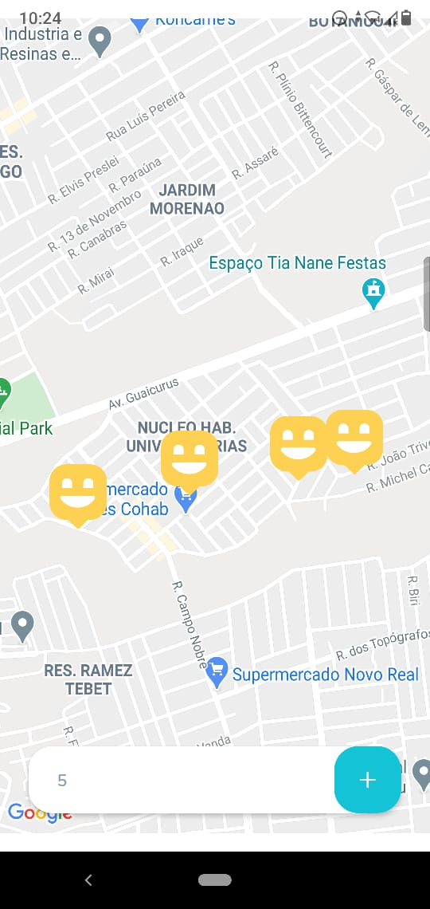

# Happy

	
	
	

Projeto feito durante a semana nlw da rocketseat. O projeto consiste em ajudar pessoas que queiram visitar orfanatos e ajudar, mostrando a localização dos orfanatos junto com os detalhes do orfanato.

	

## Tecnologias usadas

* NodeJs
* React
* React-native
